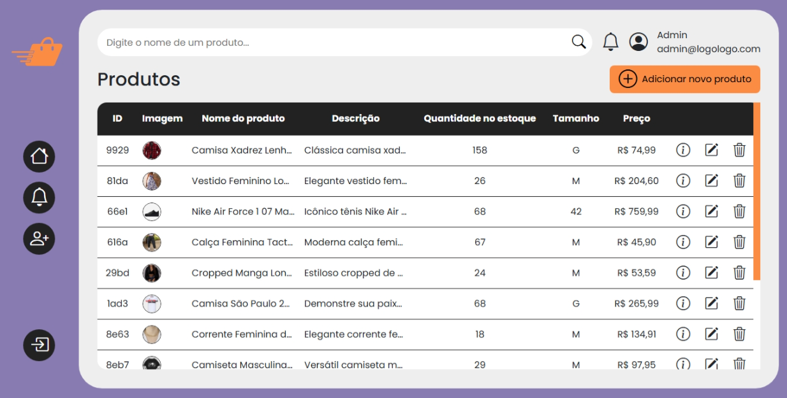

#  LOGOLOGO 

## 🏣️ O que é a LOGOLOGO

A **LOGOLOGO** é uma aplicação web de e-commerce desenvolvida para simular a operação de uma loja virtual especializada na venda de roupas e calçados, com funcionalidades de controle de estoque voltadas para pequenos e médios negócios. O projeto oferece uma experiência moderna e intuitiva tanto para usuários finais quanto para administradores do sistema.

---

## ✅ Funcionalidades

- Cadastro e autenticação de usuários (clientes e administradores)
- Login com validação e redirecionamento conforme o tipo de usuário
- Dashboard administrativo com visão geral do sistema
- Sistema de controle de estoque com entradas e saídas de produtos
- Edição de perfil do usuário
- Busca de produtos com filtro dinâmico
- Validação para evitar cadastro de usuários com e-mails duplicados

O backend foi simulado por meio do **JSON Server**, permitindo a criação de uma API REST fictícia com base em um arquivo `db.json`. Essa API oferece suporte completo a operações CRUD (criar, listar, editar e excluir), essencial para testar a lógica do frontend sem depender de uma base de dados real.

---

## 🧪 Tecnologias Utilizadas

- Angular CLI 19.2.4
- TypeScript
- HTML e CSS
- JSON Server
- Bootstrap Icons

---

## 📂 Estrutura do Projeto

```plaintext
├── backend/
│   ├── db.json
├── src/
│   ├── app/
│   │   ├── admin/
│   │   │   ├── components/
│   │   │   ├── pages/
│   │   │   ├── admin.component.css
│   │   │   ├── admin.component.html
│   │   │   ├── admin.component.spec.ts
│   │   │   └── admin.component.ts
│   │   ├── components/
│   │   ├── core/
│   │   ├── guards/
│   │   ├── pages/
│   │   ├── app.component.css
│   │   ├── app.component.html
│   │   ├── app.component.spec.ts
│   │   ├── app.component.ts
│   │   └── app.routes.ts
│   ├── assets/
│   │   └── images/
│   ├── index.html
│   ├── main.ts
│   └── styles.css
```

- Toda a lógica relacionada à criação, edição e exclusão de produtos está localizada na pasta `admin/`.
- As rotas estão definidas em `src/app/app.routes.ts` e são protegidas para que apenas usuários administradores possam acessá-las.

---

## ⚙️ Funcionamento do Backend

O backend da aplicação **LOGOLOGO** é simulado com o uso do [JSON Server](https://github.com/typicode/json-server), uma ferramenta leve que permite criar uma API REST fake a partir de um simples arquivo `.json`.

### 🧩 Estrutura do Banco de Dados (`db.json`)

O arquivo `db.json` representa o banco de dados da aplicação e está organizado em três coleções principais:

#### 🔹 Produtos (`/produtos`)
Cada produto contém os seguintes campos:

- `id`: identificador único
- `imagem`: URL da imagem
- `nome`: nome do produto
- `descricao`: descrição detalhada
- `quantidade`: estoque disponível
- `tamanho`: tamanho do item
- `preco`: preço unitário

#### 🔹 Administradores (`/admin`)
Representa os usuários com acesso à área administrativa da plataforma:

- `id`: identificador único
- `nome` e `sobrenome`: nome completo do administrador
- `email`: credencial de acesso
- `senha`: senha de acesso

#### 🔹 Clientes (`/clients`)
Contém os dados dos clientes cadastrados:

- `id`: identificador único
- `nome`: nome do cliente
- `email`: credencial de acesso
- `senha`: senha de acesso

---

### 🔁 Operações Suportadas (CRUD)

Com o `json-server` em execução, a aplicação suporta todas as operações básicas de uma API RESTFULL:

| Método | Rota             | Descrição                            |
|--------|------------------|----------------------------------------|
| GET    | `/produtos`      | Lista todos os produtos                |
| GET    | `/produtos/:id`  | Retorna um produto específico          |
| POST   | `/produtos`      | Adiciona um novo produto               |
| PUT    | `/produtos/:id`  | Atualiza um produto existente          |
| DELETE | `/produtos/:id`  | Remove um produto                      |

Essas rotas também são válidas para as entidades `/admin` e `/clients`.

---

## ⚙️ Pré-requisitos

- Ter o [Node.js](https://nodejs.org/en/download) instalado
  - Verifique a instalação via terminal:
    ```bash
    node -v      # Saída esperada: v22.14.0
    npm -v       # Saída esperada: 11.2.0
    ```
- Ter o Angular CLI instalado:
  ```bash
  npm install -g @angular/cli
  ng version
  ```
  Saída esperada:
  ```bash
  Angular CLI: 19.2.4
  Node: 22.14.0
  Package Manager: npm 11.2.0
  ```

---

## ⬇️ Clonando o Repositório

```bash
git clone https://github.com/Elociny/LOGOLOGO.git
cd LOGOLOGO
npm install
npm run dev
```

Esses comandos:
- Iniciam o Angular na porta [http://localhost:4200](http://localhost:4200)
- Iniciam o JSON Server na porta [http://localhost:3000](http://localhost:3000)

---

## 🚀 Inicializando a Aplicação

- Abra o navegador e acesse `http://localhost:4200` para ver a aplicação rodando.

---

### 👤 Tipos de Usuário

- **Cliente**: possui acesso limitado ao seu próprio perfil.
  - Com o site aberto, você pode visualizar os produtos na página inicial, se cadastrar como cliente e navegar pelas seções.
- **Administrador**: possui acesso total ao painel de administração.
  - Para testar a área administrativa, acesse com as credenciais:
    - **Email**: `admin@logologo.com`
    - **Senha**: `1234`

---

### 📸 Imagens

#### Página Inicial (Cliente)


#### Dashboard Administrativo




---

## 📄 Licença

Este projeto está licenciado sob a [Licença MIT](LICENSE).
